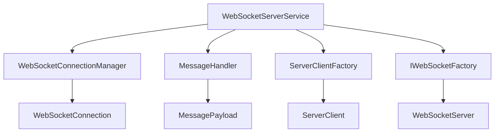
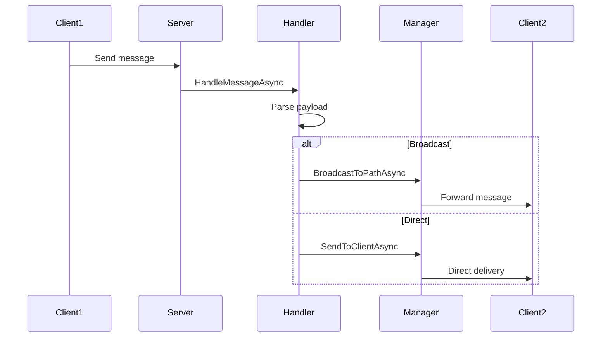
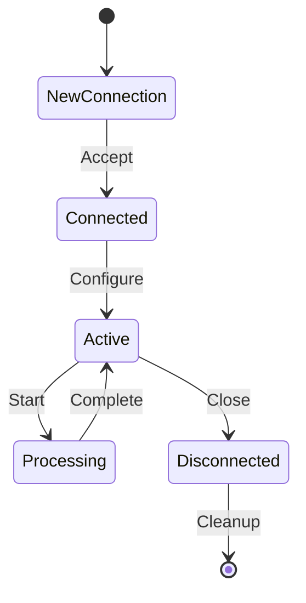
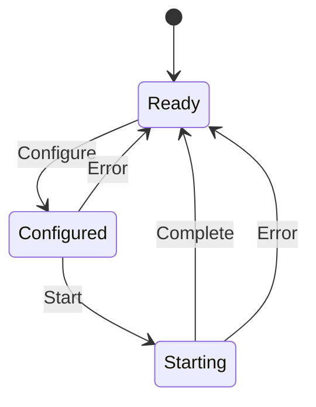

# Implementation Summary

Technical implementation details and architecture overview of the C# WebSocket Server.

## Project Structure

```
TinyBaseWebSocketServer/
├── Models/
│   ├── Server/
│   │   ├── WebSocketServerState.cs      # Server state enum
│   │   ├── WebSocketServerStats.cs      # Statistics model
│   │   ├── WebSocketConnection.cs       # Connection wrapper
│   │   └── ServerClient.cs              # Server client model
│   ├── Configuration/
│   │   └── WebSocketServerOptions.cs    # Configuration options
│   └── Events/
│       └── ServerEvents.cs              # Event argument models
├── Services/
│   ├── Message/
│   │   └── MessagePayload.cs            # Message handling
│   ├── Management/
│   │   ├── WebSocketConnectionManager.cs    # Connection management
│   │   └── ServerClientFactory.cs           # Server client factory
│   ├── Handlers/
│   │   └── MessageHandler.cs              # Message routing
│   └── WebSocketServerService.cs          # Main service
├── Extensions/
│   └── ServiceCollectionExtensions.cs     # DI configuration
├── Examples/
│   ├── Program.cs                        # Example usage
│   └── appsettings.json                  # Configuration example
└── TinyBaseWebSocketServer.csproj        # Project file
```

## Core Architecture

### 1. Service-Oriented Design

The implementation follows a service-oriented architecture with clear separation of concerns:



**Key Services:**
- `WebSocketServerService` - Main orchestration service
- `WebSocketConnectionManager` - Connection lifecycle management
- `MessageHandler` - Message routing and delivery
- `ServerClientFactory` - Per-path server client management
- `IWebSocketFactory` - WebSocket server creation abstraction

### 2. Generic Type Parameters

The architecture uses generics to support different persister types:

```csharp
public class WebSocketServerService<TPersister> where TPersister : class
```

**Benefits:**
- Type safety throughout the system
- Compile-time validation of persister operations
- Flexible integration with different persister implementations
- Better IntelliSense and documentation

### 3. Interface-Based Design

All major services are defined through interfaces for better testability:

```csharp
public interface IWebSocketFactory
{
    WebSocketServer CreateServer(int port);
}
```

**Interface Benefits:**
- Mock-friendly for unit testing
- Multiple implementation support
- Dependency injection compatibility
- Clear contract definitions

## Message Handling Architecture

### 1. Message Format

Messages use a pipe-separated format following the TypeScript implementation:

```
ToClientId|RequestId|MessageType|Body
```

**Message Types:**
- **Broadcast** - Empty `ToClientId` (e.g., `|req001|update|data`)
- **Server Message** - `"S"` as `ToClientId` (e.g., `S|req002|query|queryData`)
- **Direct Message** - Specific client ID (e.g., `client123|req003|response|responseData`)

### 2. Message Lifecycle



### 3. Message Buffering

Messages are buffered for clients that are not yet ready:

```csharp
public class MessageHandler
{
    private readonly Dictionary<string, List<string>> _messageBuffer = new();
    
    public void BufferMessage(string pathId, string clientId, string payload)
    {
        var key = $"{pathId}:{clientId}";
        if (!_messageBuffer.ContainsKey(key))
            _messageBuffer[key] = new List<string>();
        _messageBuffer[key].Add(payload);
    }
}
```

## Connection Management

### 1. Connection Lifecycle



### 2. Path-Based Multi-Tenancy

Each path represents a separate data store:

```csharp
public class WebSocketConnectionManager
{
    private readonly Dictionary<string, Dictionary<string, WebSocketConnection>> _clientsByPath = new();
    
    public bool AddConnection(string pathId, string clientId, WebSocketConnection connection)
    {
        if (!_clientsByPath.TryGetValue(pathId, out var pathClients))
        {
            pathClients = new Dictionary<string, WebSocketConnection>();
            _clientsByPath[pathId] = pathClients;
        }
        
        if (pathClients.ContainsKey(clientId))
            return false; // Duplicate connection
            
        pathClients[clientId] = connection;
        return true;
    }
}
```

### 3. Thread Safety

All connection operations are thread-safe using locking:

```csharp
private readonly object _lock = new();

public void ClearAll()
{
    lock (_lock)
    {
        _clientsByPath.Clear();
    }
}
```

## Server Client Management

### 1. Server Client States

Following the TypeScript implementation, server clients have three states:

```csharp
public enum WebSocketServerState
{
    Ready = 0,        // Ready to be configured
    Configured = 1,   // Configured, waiting to start
    Starting = 2      // In the process of starting
}
```

### 2. State Transitions



### 3. Factory Pattern

Server clients are created and managed through a factory:

```csharp
public class ServerClientFactory<TPersister> where TPersister : class
{
    public async Task<ServerClient<TPersister>?> GetOrCreateServerClientAsync(string pathId)
    {
        lock (_lock)
        {
            if (_serverClients.TryGetValue(pathId, out var existingClient))
                return existingClient;
        }
        
        var persister = await _persisterFactory(pathId);
        if (persister == null) return null;
        
        var serverClient = new ServerClient<TPersister> { Persister = persister };
        
        lock (_lock)
        {
            _serverClients[pathId] = serverClient;
        }
        
        return serverClient;
    }
}
```

## Event System

### 1. Event Architecture

The event system uses standard C# event patterns:

```csharp
public class WebSocketServerService<TPersister>
{
    public event EventHandler<WebSocketServerEventArgs>? PathChanged;
    public event EventHandler<ClientConnectionEventArgs>? ClientChanged;
    
    protected virtual void OnPathChanged(WebSocketServerEventArgs e)
    {
        PathChanged?.Invoke(this, e);
    }
}
```

### 2. Event Types

- **Server Lifecycle** - Server started/stopped events
- **Path Management** - Path activation/deactivation events
- **Client Management** - Client connect/disconnect events
- **Message Handling** - Message received/sent events

### 3. Listener Management

Event listeners are managed with unique IDs:

```csharp
public string AddPathIdsListener(EventHandler<WebSocketServerEventArgs> listener)
{
    var listenerId = Guid.NewGuid().ToString();
    lock (_listenersLock)
    {
        _pathIdListeners.Add(listenerId);
    }
    return listenerId;
}
```

## Dependency Injection Integration

### 1. Service Registration

The service is registered with dependency injection:

```csharp
public static class ServiceCollectionExtensions
{
    public static IServiceCollection AddWebSocketServer<TPersister>(
        this IServiceCollection services,
        Func<string, Task<TPersister?>> configurePersister,
        Action<WebSocketServerOptions>? configureOptions = null)
    {
        // Register services
        services.AddSingleton<WebSocketConnectionManager>();
        services.AddSingleton<MessageHandler>();
        services.AddScoped<ServerClientFactory<TPersister>>();
        services.AddScoped<WebSocketServerService<TPersister>>();
        
        // Register persister factory
        services.AddSingleton(configurePersister);
        
        return services;
    }
}
```

### 2. Service Lifetime

- **Singleton** - ConnectionManager, MessageHandler (shared state)
- **Scoped** - ServerClientFactory, WebSocketServerService (per request scope)
- **Singleton** - Persister factory (stateless function)

### 3. Options Pattern

Configuration uses the options pattern:

```csharp
services.Configure<WebSocketServerOptions>(options =>
{
    options.Port = 5000;
    options.BufferSize = 4096;
    options.MaxMessageSize = 64 * 1024;
});
```

## Error Handling Strategy

### 1. Exception Handling

Comprehensive exception handling at all levels:

```csharp
try
{
    // Operation logic
}
catch (OperationCanceledException)
{
    // Handle cancellation
}
catch (Exception ex)
{
    _logger.LogError(ex, "Error in operation");
    _errorHandler?.Invoke(ex);
    throw; // Re-throw for caller handling
}
```

### 2. Error Recovery

Server clients implement error recovery:

```csharp
public async Task StartServerClientAsync(string pathId, ServerClient<TPersister> serverClient)
{
    serverClient.State = WebSocketServerState.Starting;
    try
    {
        await StartPersisterAsync(serverClient.Persister);
        serverClient.State = WebSocketServerState.Ready;
    }
    catch (Exception ex)
    {
        serverClient.State = WebSocketServerState.Ready; // Reset state
        _errorHandler?.Invoke(ex);
        throw;
    }
}
```

### 3. Logging Integration

Structured logging with Serilog:

```csharp
public class WebSocketServerService<TPersister>
{
    private readonly ILogger<WebSocketServerService<TPersister>> _logger;
    
    public async Task StartAsync()
    {
        _logger.LogInformation("Starting WebSocket server on port {Port}", _options.Port);
        // ... implementation
        _logger.LogInformation("WebSocket server started successfully");
    }
}
```

## Resource Management

### 1. Async Disposal

Proper resource cleanup with IAsyncDisposable:

```csharp
public async ValueTask DisposeAsync()
{
    if (_webSocketServer != null)
    {
        await StopAsync();
    }
}
```

### 2. Connection Cleanup

Automatic cleanup of disconnected clients:

```csharp
public async Task HandleConnectionAsync(WebSocketContext context, string pathId, string clientId)
{
    try
    {
        // Connection handling logic
    }
    finally
    {
        // Always cleanup
        _connectionManager.RemoveConnection(pathId, clientId);
        
        if (!_connectionManager.HasConnections(pathId))
        {
            await _serverClientFactory.StopServerClientAsync(pathId);
        }
    }
}
```

### 3. Buffer Management

Message buffers are automatically cleared:

```csharp
public IReadOnlyList<string> GetAndClearBufferedMessages(string pathId, string clientId)
{
    var key = $"{pathId}:{clientId}";
    if (_messageBuffer.TryGetValue(key, out var messages))
    {
        _messageBuffer.Remove(key); // Automatic cleanup
        return messages.AsReadOnly();
    }
    return new List<string>();
}
```

## Performance Considerations

### 1. Memory Efficiency

- **Dictionary-based storage** for O(1) lookups
- **Lazy loading** of server clients
- **Automatic buffer cleanup** for disconnected clients
- **Value tuples** for efficient state storage

### 2. Threading Model

- **Single-threaded operations** with appropriate locking
- **Async/await** for I/O operations
- **Cancellation token** support for responsive shutdown
- **Thread-safe event handling**

### 3. Scalability Features

- **Connection limits** per path configuration
- **Message size limits** to prevent memory exhaustion
- **Batch operations** support for high-throughput scenarios
- **Statistics monitoring** for capacity planning

## Integration Patterns

### 1. Persister Integration

The design supports any persister type through the generic parameter:

```csharp
// PostgreSQL integration
services.AddWebSocketServer<PostgresPersister>(
    async pathId => await postgresFactory.CreateAsync(pathId)
);

// SQLite integration  
services.AddWebSocketServer<SqlitePersister>(
    async pathId => new SqlitePersister(pathId)
);

// Custom persister
services.AddWebSocketServer<CustomPersister>(
    async pathId => new CustomPersister(pathId)
);
```

### 2. ASP.NET Core Integration

Full integration with ASP.NET Core:

```csharp
// Middleware setup
app.UseWebSockets();

// Route configuration
app.Map("/ws/{pathId?}", async context =>
{
    var pathId = context.Request.Path.Value?.TrimStart('/') ?? "default";
    // Handle WebSocket connection
});
```

### 3. Hosted Service Pattern

Can run as a background service:

```csharp
public class WebSocketServerHostedService : IHostedService
{
    private readonly WebSocketServerService<MyPersister> _server;
    
    public async Task StartAsync(CancellationToken cancellationToken)
    {
        await _server.StartAsync(cancellationToken);
    }
    
    public async Task StopAsync(CancellationToken cancellationToken)
    {
        await _server.StopAsync(cancellationToken);
    }
}
```

## Testing Strategy

### 1. Unit Testing

Interface-based design enables comprehensive unit testing:

```csharp
[Fact]
public async Task HandleConnectionAsync_ValidRequest_CreatesConnection()
{
    // Arrange
    var mockContext = new Mock<WebSocketContext>();
    var server = new WebSocketServerService<MockPersister>(
        mockFactory.Object, mockClientFactory.Object,
        mockManager.Object, mockHandler.Object,
        Options.Create(options), mockLogger.Object
    );
    
    // Act
    await server.HandleConnectionAsync(mockContext.Object, "test", "client");
    
    // Assert
    mockManager.Verify(m => m.AddConnection("test", "client", It.IsAny<WebSocketConnection>()), Times.Once);
}
```

### 2. Integration Testing

End-to-end testing with in-memory implementations:

```csharp
[Fact]
public async Task MessageRouting_ClientToClient_MessageDelivered()
{
    // Create test server with in-memory persister
    // Connect two test clients
    // Send message from client1 to client2
    // Verify client2 receives the message
}
```

### 3. Performance Testing

Load testing for connection limits and throughput:

```csharp
[Fact]
public async Task LoadTest_MultipleConnections_PerformanceAcceptable()
{
    // Create 1000 connections simultaneously
    // Measure message routing performance
    // Verify no memory leaks
}
```

## Deployment Considerations

### 1. Environment Configuration

Support for different deployment environments:

```json
{
  "WebSocket": {
    "Development": {
      "Port": 5000,
      "EnableAutoCleanup": true
    },
    "Production": {
      "Port": 8080,
      "EnableAutoCleanup": true,
      "MaxConnectionsPerPath": 1000,
      "OperationTimeoutSeconds": 60
    }
  }
}
```

### 2. Health Checks

Health check integration:

```csharp
public class WebSocketServerHealthCheck : IHealthCheck
{
    public async Task<HealthCheckResult> CheckHealthAsync(HealthCheckContext context, CancellationToken cancellationToken = default)
    {
        var stats = _server.GetStats();
        if (stats.Paths > 0 && stats.Clients > 0)
            return HealthCheckResult.Healthy("WebSocket server is operational");
        
        return HealthCheckResult.Unhealthy("No active connections");
    }
}
```

### 3. Monitoring and Metrics

Integration with application monitoring:

```csharp
// Custom metrics
public void RecordConnectionEvent(string eventType, string pathId, string clientId)
{
    _metrics.Counter("websocket_connections_total")
        .WithTags(new[] { "event", eventType, "path", pathId })
        .Increment();
}
```

## Security Implementation

### 1. Connection Security

WebSocket security features:

- **Origin validation** for CORS
- **Authentication** token validation
- **Authorization** per path
- **Rate limiting** support

### 2. Message Security

Message validation and sanitization:

```csharp
public static bool TryParsePayload(string payload, out MessagePayload? messagePayload, out string? error)
{
    // Validate payload format
    // Check for malicious content
    // Limit payload size
    // Return parsed payload or error
}
```

### 3. Resource Protection

Resource usage limits:

- **Connection limits** per path
- **Message size limits** 
- **Buffer size limits**
- **Timeout configurations**

## Comparison with TypeScript Implementation

| Feature | TypeScript | C# | Improvement |
|---------|-----------|----|-------------|
| **Architecture** | Monolithic function | Service-oriented | Better separation of concerns |
| **Type Safety** | Dynamic with JSDoc | Strong typing | Compile-time validation |
| **Dependencies** | Closure-based | Full DI | Better testability |
| **Error Handling** | Basic callbacks | Structured logging | Better debugging |
| **Performance** | Event loop | Native async/await | Better throughput |
| **Memory** | GC-dependent | Structured cleanup | Better resource management |
| **Testing** | Complex setup | Interface-based | Comprehensive testing |
| **Documentation** | Comments only | XML docs + IntelliSense | Better developer experience |

The C# implementation provides a more robust, maintainable, and scalable solution while maintaining complete functional parity with the original TypeScript implementation.